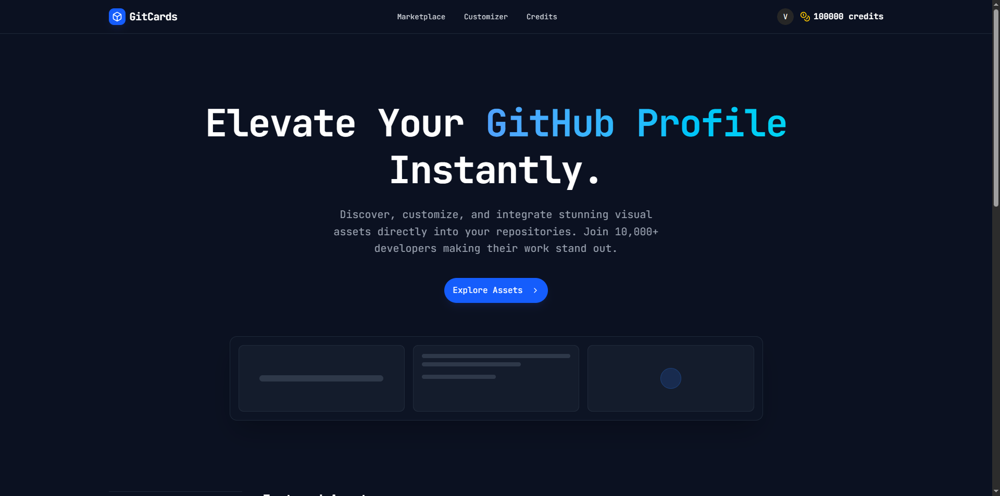

<div align="center">
  <h1>Git Cards - Architecture Showcase</h1>
  <p>
    <strong>Micro-SaaS para personalização de perfis GitHub com assets SVG dinâmicos.</strong>
  </p>
  
  <p>
    <a href="https://gitcards.victorlisbronzo.me/">
      
    </a>
  </p>

  <p>
    <a href="#-o-produto">O Produto</a> •
    <a href="#-arquitetura-e-engenharia">Engenharia</a> •
    <a href="#-stack-tecnologica">Stack</a> •
    <a href="#-decisoes-tecnicas">Decisões Técnicas</a>
  </p>
</div>

> ⚠️ **Nota:** Este repositório é um Showcase Público de um projeto privado. Ele contém a documentação arquitetural, diagramas e explicação das decisões técnicas. O código-fonte original é mantido em um repositório privado para proteção de propriedade intelectual.

## 🚀 O Produto

### O Problema

O perfil do GitHub é o currículo moderno do desenvolvedor. No entanto, a maioria dos arquivos README.md de perfil são estáticos, limitados a textos e listas simples, falhando em capturar a personalidade ou as métricas reais do desenvolvedor.

### A Solução: GitCards

O GitCards é uma plataforma que permite a desenvolvedores adquirirem e personalizarem Cards SVG Premium. Estes cards não são apenas imagens; são componentes projetados para se integrarem perfeitamente ao modo escuro/claro do GitHub, exibindo informações com estética de alto nível.

### Funcionalidades Chave

- 🛍️ **Marketplace de Assets:** Uma loja virtual onde usuários podem navegar por templates exclusivos.
- 🎨 **Customização em Tempo Real:** Editor WYSIWYG para alterar cores, textos e ícones dos cards antes da compra.
- ⚡ **Entrega Dinâmica:** O sistema gera URLs únicas para cada asset adquirido, servindo SVGs otimizados via CDN/API.
- 💳 **Sistema de Créditos:** Integração com Mercado Pago para compra de pacotes de créditos.
- 🔐 **Autenticação Híbrida:** Login via Magic Link e gerenciamento de perfil seguro.

## 🏗️ Arquitetura e Engenharia

Este projeto foi construído sobre uma arquitetura de Monorepo (TurboRepo), focada em performance, type-safety estrita e separação de responsabilidades.

### Diagrama de Alto Nível

```mermaid
graph TD
    User[Usuário / GitHub] -->|HTTPS| Nginx[Nginx Proxy Reverso]
    
    subgraph Infrastructure [Docker Containers]
        Nginx -->|/api/*| API[Node.js API (Fastify)]
        Nginx -->|/*| Web[Next.js App (Frontend)]
        
        API -->|Read/Write| DB[(PostgreSQL)]
        API -->|Transacional| MP[Mercado Pago API]
        API -->|Transactional Emails| Resend[Resend API]
    end
    
    Web -.->|Shared Types| Packages[Shared Packages (@gitcards/schemas)]
    API -.->|Shared Types| Packages
```

### 📂 Estrutura do Monorepo

A organização do código segue o padrão de workspaces do PNPM/TurboRepo:

- `/nextjs`: Aplicação Frontend (App Router). Responsável pela UI, Dashboard do Usuário, Marketplace e Editor.
- `/nodejs`: API Backend (Fastify). Responsável pela lógica de negócios, geração de SVGs, Webhooks de pagamento e Auth.
- `/packages`: Bibliotecas internas compartilhadas.
  - `schemas`: O "coração" da tipagem. Contém todos os schemas Zod que são usados tanto pelo Frontend (validação de formulários) quanto pelo Backend (validação de rotas e tipagem de resposta).
- `/nginx`: Configuração do Proxy Reverso e Certbot para SSL.

## 🛠️ Stack Tecnológica

### Backend (Performance First)

- **Runtime:** Node.js
- **Framework:** Fastify (Escolhido pela baixa sobrecarga e performance superior ao Express).
- **ORM:** Prisma (PostgreSQL).
- **Validação:** Zod (integração nativa com fastify-type-provider-zod).
- **Pagamentos:** SDK Mercado Pago.
- **Emails:** Resend.

### Frontend (User Experience)

- **Framework:** Next.js 15 (App Router).
- **Estilização:** Tailwind CSS v4 + Shadcn/ui + Lucide Icons.
- **State Management:** TanStack Query (React Query) para gerenciamento de estado assíncrono e cache.
- **Forms:** React Hook Form + Zod Resolvers.

### DevOps & Infra

- **Containerização:** Docker & Docker Compose.
- **Build System:** TurboRepo (para cacheamento de builds e execução paralela).
- **Proxy:** Nginx (gerenciando domínios da API e da Web).

## 💡 Decisões Técnicas (ADRs)

### 1. Single Source of Truth para Tipagem

- **Decisão:** Em vez de duplicar interfaces TypeScript no Frontend e no Backend, criei um pacote interno `@gitcards/packages`.
- **Benefício:** Se eu altero um campo no banco de dados, eu atualizo o schema Zod neste pacote. Imediatamente, o Backend sabe que precisa validar esse campo e o Frontend sabe que o formulário precisa desse input. Isso elimina 90% dos bugs de integração.

### 2. Fastify vs. Next.js API Routes

- **Decisão:** Separei o Backend em um serviço Node.js dedicado com Fastify, em vez de usar as API Routes do Next.js.
- **Motivo:**
  - **Escalabilidade:** O serviço de geração e entrega de SVGs precisa ser extremamente rápido e pode escalar independentemente do Frontend.
  - **Arquitetura Limpa:** O Fastify permite uma estrutura de injeção de dependência e separação de Services/Controllers mais robusta para lógicas complexas (como os webhooks de pagamento e geração de auth codes).

### 3. Sistema de Autenticação Customizado

- **Decisão:** Implementação de um sistema de Auth baseado em JWT e códigos OTP (Magic Links/Codes) via email.
- **Motivo:** Reduzir a fricção de entrada (passwordless) e ter controle total sobre a sessão do usuário e verificação de conta, mantendo a segurança com tokens de curta duração e refresh tokens.

### 4. Geração de Assets

Os cards não são gerados no momento da requisição (SSR pesado). Eles são templates SVG manipulados com base nos dados do usuário e servidos de forma otimizada.

## 📸 Galeria (Mockups)

### Marketplace
Vitrine de cards disponíveis

### Customização
Editor visual com preview em tempo real

## 👨‍💻 Autor

**Victor Lis**
Software Engineer & Content Creator

Focado em criar experiências digitais de alta performance e arquiteturas escaláveis.

<p align="center">
  Feito com 💜 e TypeScript.
</p>