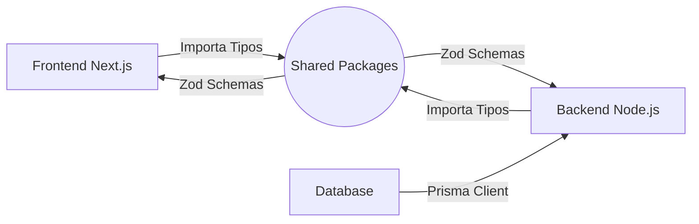
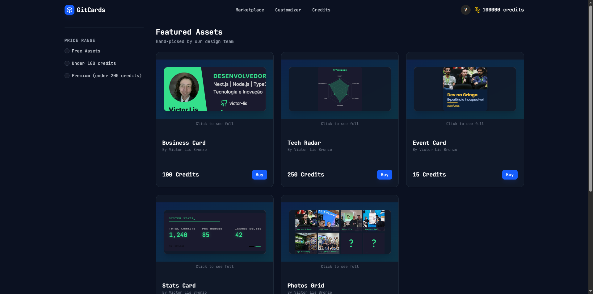
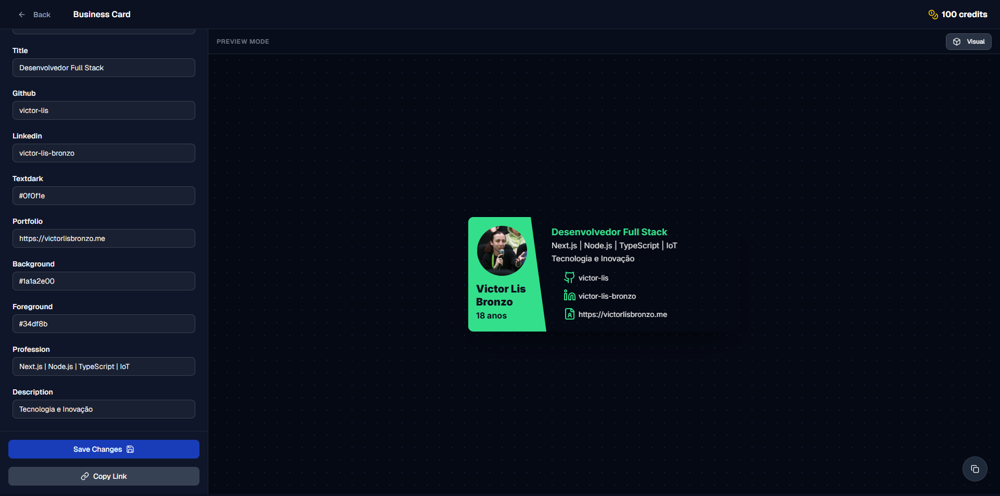

# 🔮 GitCards Showcase

> A plataforma definitiva para desenvolvedores criarem, personalizarem e compartilharem seus "Developer Cards" dinâmicos.

 

&nbsp;

&nbsp;

## 🎯 Parte 1: O Produto

### O que é o GitCards?

O GitCards é uma aplicação Full-Stack SaaS que permite a desenvolvedores transformarem seus dados do GitHub e Tech Stack em cartões visuais de alto impacto. Esses "cards" são gerados dinamicamente e otimizados para serem compartilhados em redes sociais (LinkedIn, Twitter) ou incorporados diretamente no README.md de seus perfis.

### 🌟 Funcionalidades & Fluxo

A aplicação não é apenas um gerador de imagens; é um ecossistema completo com economia interna:

- **Marketplace de Templates:** Uma loja onde designers podem disponibilizar layouts e usuários podem adquiri-los.
- **Sistema de Créditos:** Integração financeira real. Usuários compram "Pacotes de Créditos" (microtransações) para desbloquear templates premium.
- **Editor WYSIWYG:** Customização em tempo real das cores, fontes, dados e visibilidade dos elementos do card.
- **Autenticação Moderna:** Login sem senha (Magic Link) e validação via códigos OTP enviados por e-mail.

  <h3>✨ Experimente agora:</h3>
  

## 🏗️ Parte 2: Engenharia & Arquitetura

> 💡 **Nota Técnica:** Como o código-fonte é proprietário, esta seção detalha as decisões arquiteturais de alto nível que garantem escalabilidade, segurança e manutenibilidade.

### ⚡ Tech Stack

| Camada | Tecnologia Principal | Por que foi escolhida? |
| :--- | :--- | :--- |
| **Core** | Turborepo (Monorepo) | Gerenciamento centralizado de pacotes, linting e build cacheado. |
| **Frontend** | Next.js 14 (App Router) | Renderização híbrida (SSR para SEO, CSR para o Editor) e performance. |
| **Backend** | Node.js + Fastify | Baixo overhead e alta taxa de requests por segundo (RPS) para a API. |
| **Database** | PostgreSQL + Prisma | Integridade relacional robusta e Developer Experience (DX) superior. |
| **Tipagem** | TypeScript + Zod | Validação de dados em runtime e time-to-market seguro. |
| **Infra** | Docker + Nginx | Containerização completa e proxy reverso para produção. |

### 📐 Arquitetura: End-to-End Type Safety

O diferencial técnico deste projeto é o compartilhamento estrito de contratos de dados entre Frontend e Backend.

## 📸 Galeria (Mockups)

### Marketplace
> Vitrine de cards disponíveis para compra e personalização.

### Customização
> Editor visual com preview em tempo real e ajustes finos.

## 👨‍💻 Autor

 
<b>Victor Lis</b>
 

Software Engineer & Content Creator
 
Focado em criar experiências digitais de alta performance e arquiteturas escaláveis.

 

 

 
 

  Feito com 💜 e TypeScript.

