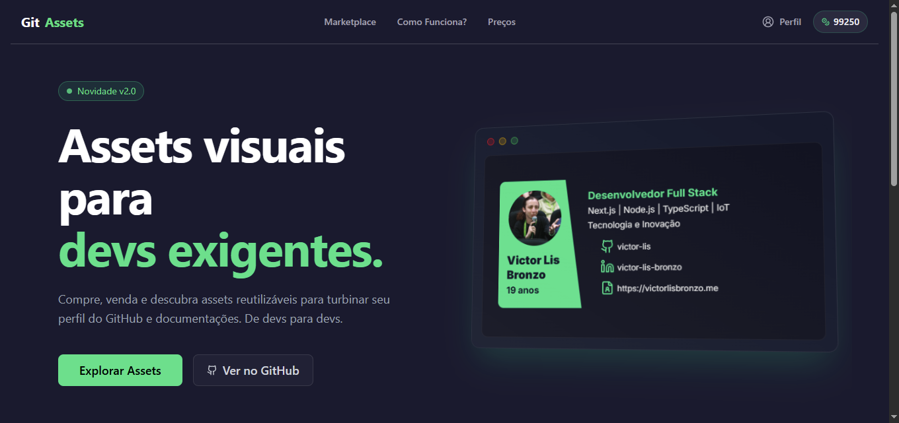

# 🛠️ Git Assets

> **Git Assets** — Assets visuais e componentes para desenvolvedores exigentes que querem destacar seus perfis e README no GitHub.  
> Tudo que você precisa para documentações mais ricas e profissionais. 🌟 

---

## 📌 Índice

- [Sobre](#sobre)
- [Demonstração](#demonstração)
- [Funcionalidades](#funcionalidades)
- [Tecnologias usadas](#tecnologias-usadas)
- [Como usar](#como-usar)
- [Links importantes](#links-importantes)
- [Contribuições](#contribuições)
- [Licença](#licença)
- [Autor](#autor)

---

## 🚀 Sobre

Uma plataforma que oferece **assets visuais reutilizáveis** fáceis de integrar em seus projetos e perfis GitHub, com foco em melhorar a apresentação e destacar seu trabalho profissional.
---

## 💡 Como surgiu a ideia?

Sempre gostei de personalizar meu perfil do GitHub e README, mas sentia que faltava algo mais profissional e visual. As principais soluções eram APIs limitadas e cheias de parâmetros, que tornava a experiência um pouco frustrante. Então, decidi criar o **Git Assets** para oferecer uma solução mais simples, visual e fácil de usar, com uma variedade de componentes de fácil edição e integração.

## 📸 Demonstração

> (Aqui você pode inserir **uma imagem ou GIF** do seu projeto funcionando — por exemplo uma captura da página principal ou cards sendo usados)

---

  

---

## 🛠️ Stack & Arquitetura

### 🚀 Tecnologias Principais

- **Next.js** (App Router + Server Actions)
- **Node.js**
- **PostgreSQL**
- **TypeScript**
- **Prisma ORM**
- **Fastify**
- **pnpm workspaces**
- **Turborepo**

---

## 🧱 Arquitetura

> Monorepo modular com foco em performance, isolamento de responsabilidades e reutilização de regras de negócio.

A arquitetura foi projetada para extrair o máximo do potencial do **Next.js no server-side**, priorizando performance e organização estrutural.

Na versão anterior do projeto, todas as conexões com o banco eram feitas exclusivamente via API. Isso tornava o uso do Next.js subaproveitado. Então eu poderia apenas criar uma aplicação React tradicional.

Com isso em mente, reestruturei o sistema para uma abordagem **modular e orientada a domínio**, utilizando **pnpm workspaces** e **Turborepo**, permitindo:

- Desenvolvimento independente por pacote
- Reutilização centralizada das regras de negócio
- Tipagem compartilhada em toda a aplicação
- Escalabilidade limpa e previsível

---

## 📦 Estrutura do Monorepo

### `database`
- Conexão com **PostgreSQL**
- Prisma ORM
- Configuração e gerenciamento de schema

### `packages`
- DTOs
- Schemas de validação
- Tipagem compartilhada

### `core`
- Regras de negócio
- Lógica principal da aplicação
- Camada independente de framework

### `api`
- Rotas com **Fastify**
- Webhooks (ex: Mercado Pago)
- Serviços isolados da camada web

> Poderia utilizar as rotas do próprio Next.js, inclusive com Fastify,
> mas optei pelo isolamento estratégico da API.

### `web`
- Interface com **Next.js**
- Uso intensivo de **Server Actions**
- Arquitetura com **Compound Components**
- Foco em performance e UX

 
 

---

## 🎯 Decisões Arquiteturais

- Priorizar **server-side rendering e performance**
- Separar regras de negócio da camada de framework
- Evitar acoplamento entre web e lógica principal
- Manter tipagem única e consistente em todo o sistema
- Facilitar testes e futura escalabilidade

Já queria há um tempo trabalhar com a integração de pacotes do node, e o Turborepo foi uma descoberta que fiz nesse procesos. Gostei muito das características desse projeto, além de práticar a arquitetura de monorepo, acabei realmente achando uma boa prática esse isolamento para testes e manutenção.

---

## 📋 Como usar
Basta acessar a plataforma em [`https://gitassets.victorlisbronzo.me`](https://gitassets.victorlisbronzo.me), criar uma conta, adquirir os assets desejados e seguir as instruções para integrar em seus perfis ou projetos. 

---

## 🔗 Links importantes
- 🌐 Website: https://gitassets.victorlisbronzo.me/
- 📄 Documentação adicional: https://gitassets.victorlisbronzo.me/docs

---

## 🤝 Contribuições
Contribuições são bem-vindas! Ideias ou sugestões? Pode enviar um email para [victorlisbronzo1@gmail.com](mailto:victorlisbronzo1@gmail.com)

---

## 👨‍💻 Autor
  